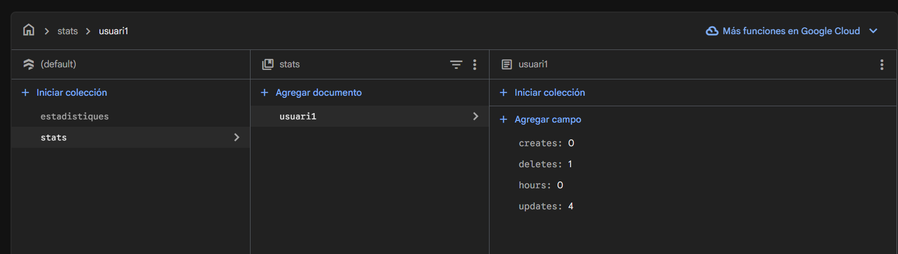
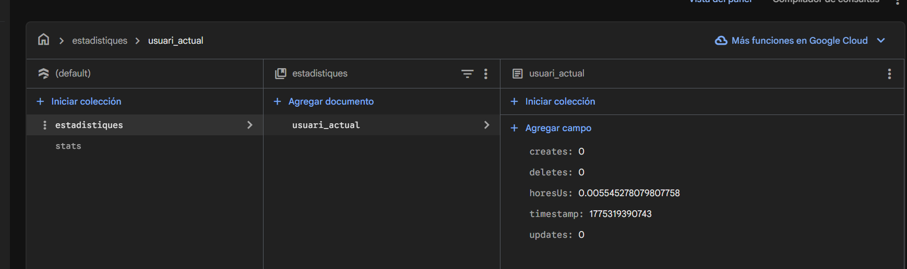

# Millores fetes a l'aplicació

## Implementar Splash Screen

És una pantalla que es mostra quan obres l'app; apareix mentre les dades es carreguen i després desapareix. Per poder implementar-la, hem de posar la següent dependència al build.gradle:

```
dependencies {
    ...
    implementation 'androidx.core:core-splashscreen:1.2.0' 
    ...
}
```
Sincronitzem i anem a /res/values/themes/themes.xml per crear un estil que hereti de Theme.SplashScreen i especificar l'icona animada i el tema de la següent activitat:

```
<style name="Theme.App.SplashScreen" parent="Theme.SplashScreen">
    <item name="windowSplashScreenBackground">@color/background_app</item>
    <item name="windowSplashScreenAnimatedIcon">@drawable/splash_foreground</item>
    <item name="windowSplashScreenAnimationDuration">1000</item>
    <item name="postSplashScreenTheme">@style/Base.Theme.notekeeper</item>
</style>
```

En el nostre cas, hem utilitzat una imatge SVG que pesa menys i té més qualitat. A més, hem posat una transició que fa que la pantalla d'inici es mostri suament.

```
val splashScreen = installSplashScreen()

super.onCreate(savedInstanceState)
setContentView(R.layout.activity_main)

val rootView = findViewById<View>(android.R.id.content)
val fadeIn = AlphaAnimation(0f, 1f)
fadeIn.duration = 1500
rootView.startAnimation(fadeIn)
```

## Implementar menú als ítems

Abans teníem un fragment bin que emmagatzemava totes les notes eliminades, però era confús entendre aquest mecanisme. Per aquesta raó, al Home hem posat un ImageView amb la icona de la paperera a la part superior dreta que, en fer-hi clic, et porta al fragment on estan les notes eliminades.

A més, hem posat un menú de tres punts a cada ítem del RecyclerView per poder eliminar o editar les notes. Per crear aquest menú, hem d'anar a res/menu i crear un fitxer amb el següent contingut:

```
<?xml version="1.0" encoding="utf-8"?>
<menu xmlns:android="http://schemas.android.com/apk/res/android">
    <item
        android:id="@+id/action_move_to_bin"
        android:title="Moure a la paperera" />

    <item
        android:id="@+id/action_edit_note"
        android:title="Editar nota"/>
</menu>
```

Al RecyclerViewAdapter, dins del mètode onBindViewHolder, configurem el PopupMenu per al menú de tres punts de cada ítem:

Adapter: Gestiona el clic en les opcions del menú i comunica l'acció mitjançant un callback (onItemClick).

ViewHolder: Vincula les vistes i detecta la pulsació en el botó del menú (iBtnMenuMore).

```
// Configurar el menú de tres punts 
holder.btnMenuMore.setOnClickListener { view ->
    val popup = PopupMenu(view.context, view)

    // Infla el menú d'opcions de la nota
    popup.menuInflater.inflate(R.menu.menu_nota_item, popup.menu)

    // Gestiona el clic en les opcions del menú desplegable
    popup.setOnMenuItemClickListener { menuItem ->
        when (menuItem.itemId) {
            R.id.action_move_to_bin -> {
                // Lògica per moure la nota a la llista de la paperera
                onItemClick(item)
                true
            }

            R.id.action_edit_note -> {
                // Cridem a la funció onItemClick per editar la nota
                onItemClick(item)
                true
            }

            else -> false
        }
    }
    popup.show()
}
```
## Implementar ViewModel

El ViewModel serveix per verificar l'email i la contrasenya durant el registre i l'inici de sessió. A més, s'encarrega de guardar les dades en un Repository com un Singleton per poder accedir a la informació, com l'email de l'usuari, des de qualsevol punt de l'aplicació.

Hem creat SignInViewModel i LogInViewModel, que hereten de la classe ViewModel. Aquestes dues classes s'encarreguen de comprovar que el format de l'email i contrasenya siguin forta.

```
package com.notekeeper

import android.graphics.Color
import androidx.lifecycle.LiveData
import androidx.lifecycle.MutableLiveData
import androidx.lifecycle.ViewModel

class SignInViewModel : ViewModel() {

    // Tenim dues variables que gestionen el mateix valor:
    // Una és privada i mutable (_), s'utilitza dins del ViewModel per actualitzar els valors.
    // L'altra és pública i immutable, i s'utilitza per exposar les dades a la vista (Fragment).
    // Totes dues utilitzen LiveData per reaccionar als canvis en temps real.

    private val _isSignInEnabled = MutableLiveData<Boolean>(false)
    val isSignInEnabled: LiveData<Boolean> = _isSignInEnabled

    // Variables per gestionar l'estat de l'etiqueta de l'Email
    private val _emailLabelText = MutableLiveData<String>("Email")
    val emailLabelText: LiveData<String> = _emailLabelText

    private val _emailLabelColor = MutableLiveData<Int>(Color.WHITE)
    val emailLabelColor: LiveData<Int> = _emailLabelColor

    // Variables per gestionar l'estat de l'etiqueta de la Contrasenya
    private val _passLabelText = MutableLiveData<String>("Contrasenya")
    val passLabelText: LiveData<String> = _passLabelText

    private val _passLabelColor = MutableLiveData<Int>(Color.WHITE)
    val passLabelColor: LiveData<Int> = _passLabelColor

    fun registrarEnRepositorio(email: String, pass: String) {
        // El ViewModel indica al repositori que guardi les dades de l'usuari
        UserRepository.registrarUsuario(email, pass)
    }

    fun onSignInChanged(emailInput: String, passwordInput: String) {
        val emailEsValido = emailInput.contains("@") && emailInput.contains(".")

        // Si el camp està buit, l'avís es mostra en blanc
        if (emailInput.isEmpty()) {
            _emailLabelText.value = "Email"
            _emailLabelColor.value = Color.WHITE
        } else {
            // Si és vàlid es mostra en verd, si no en vermell
            if (emailEsValido) {
                _emailLabelText.value = "Email - ¡Vàlid!"
                _emailLabelColor.value = Color.parseColor("#2ecc71")
            } else {
                _emailLabelText.value = "Email - Invàlid"
                _emailLabelColor.value = Color.parseColor("#e74c3c")
            }
        }

        val passEsFuerte = isStrongPassword(passwordInput)

        if (passwordInput.isEmpty()) {
            _passLabelText.value = "Contrasenya"
            _passLabelColor.value = Color.WHITE
        } else {
            if (passEsFuerte) {
                _passLabelText.value = "Contrasenya - ¡Segura!"
                _passLabelColor.value = Color.parseColor("#2ecc71")
            } else {
                _passLabelText.value = "Contrasenya - Febre"
                _passLabelColor.value = Color.parseColor("#e74c3c")
            }
        }

        // Si ambdós camps són correctes, s'habilita el botó de registre
        _isSignInEnabled.value = emailEsValido && passEsFuerte
    }

    private fun isStrongPassword(pass: String): Boolean {
        if (pass.length < 8) return false
        var teMajuscula = false
        var teMinuscula = false
        var teNumero = false
        var teSimbol = false
        for (caracter in pass) {
            if (caracter.isUpperCase()) teMajuscula = true
            if (caracter.isLowerCase()) teMinuscula = true
            if (caracter.isDigit()) teNumero = true
            if (!caracter.isLetterOrDigit()) teSimbol = true
        }
        return teMajuscula && teMinuscula && teNumero && teSimbol
    }
}
```

```
package com.notekeeper

import android.graphics.Color
import androidx.lifecycle.LiveData
import androidx.lifecycle.MutableLiveData
import androidx.lifecycle.ViewModel

class LogInViewModel : ViewModel() {

    // Tenemos dos variables que guardan el mismo valor
    // Una es privada y mutable, se usa dentro del ViewModel para actualizar los valores
    // Empieza con un guion bajo porque es privada y no se puede acceder desde fuera
    // La otra es pública e inmutable, y se usa para mostrar los datos al usuario
    // Ambas variables se almacenan en LiveData ya que permite guardar lo que el usuario en el momento
    private val _isLoginEnabled = MutableLiveData<Boolean>(false)
    val isLoginEnabled: LiveData<Boolean> = _isLoginEnabled

    private val _emailLabelText = MutableLiveData<String>("Email")
    val emailLabelText: LiveData<String> = _emailLabelText

    private val _emailLabelColor = MutableLiveData<Int>(Color.WHITE)
    val emailLabelColor: LiveData<Int> = _emailLabelColor

    private val _passLabelText = MutableLiveData<String>("Contraseña")
    val passLabelText: LiveData<String> = _passLabelText

    private val _passLabelColor = MutableLiveData<Int>(Color.WHITE)
    val passLabelColor: LiveData<Int> = _passLabelColor


    fun onLoginChanged(emailInput: String, passwordInput: String) {

        val emailEsValido = emailInput.contains("@") && emailInput.contains(".")

        //Si esta vació el email el warnig se muestra en blanco
        if (emailInput.isEmpty()) {
            _emailLabelText.value = "Email"
            _emailLabelColor.value = Color.WHITE
        } else {
            //Si cumple con las condiciones el email se muestra en verde
            if (emailEsValido) {
                _emailLabelText.value = "Email - ¡Válido!"
                _emailLabelColor.value = Color.parseColor("#2ecc71")
            } else {
                //Si no en rojo
                _emailLabelText.value = "Email - Inválido"
                _emailLabelColor.value = Color.parseColor("#e74c3c")
            }
        }

        //Llamamos a la función que válida la contraseña
        val passEsFuerte = isStrongPassword(passwordInput)


        if (passwordInput.isEmpty()) {
            _passLabelText.value = "Contraseña"
            _passLabelColor.value = Color.WHITE
        } else {
            if (passEsFuerte) {
                _passLabelText.value = "Contraseña - ¡Segura!"
                _passLabelColor.value = Color.parseColor("#2ecc71")
            } else {
                _passLabelText.value = "Contraseña - Débil"
                _passLabelColor.value = Color.parseColor("#e74c3c")
            }
        }

        //Si email y contraseña esta bien pues pueden passar
        if (emailEsValido && passEsFuerte) {
            _isLoginEnabled.value = true
        } else {
            _isLoginEnabled.value = false
        }
    }

    //Requisito de la contraseña
    private fun isStrongPassword(pass: String): Boolean {
        if (pass.length < 8) return false
        var teMajuscula = false
        var teMinuscula = false
        var teNumero = false
        var teSimbol = false
        for (caracter in pass) {
            if (caracter.isUpperCase()) teMajuscula = true
            if (caracter.isLowerCase()) teMinuscula = true
            if (caracter.isDigit()) teNumero = true
            if (!caracter.isLetterOrDigit()) teSimbol = true
        }
        return teMajuscula && teMinuscula && teNumero && teSimbol
    }
}
```

D'altra banda, als Fragments SignIn i LogIn cridem al ViewModel per observar els canvis. En el cas del SignIn, quan l'usuari clica el botó, les dades es guarden a l'UserRepository en un Singleton que manté l'email de l'usuari actiu.

```
package com.notekeeper

import android.os.Bundle
import androidx.fragment.app.Fragment
import android.view.LayoutInflater
import android.view.View
import android.view.ViewGroup
import android.widget.Button
import android.widget.EditText
import android.widget.TextView
import androidx.fragment.app.viewModels
import androidx.core.widget.addTextChangedListener

class LogIn : Fragment() {

    private val logInViewModel : LogInViewModel by viewModels()

    override fun onCreateView(
        inflater: LayoutInflater, container: ViewGroup?,
        savedInstanceState: Bundle?
    ): View? {
        return inflater.inflate(R.layout.fragment_log_in, container, false)
    }

    override fun onViewCreated(view: View, savedInstanceState: Bundle?) {
        super.onViewCreated(view, savedInstanceState)

        val etEmail = view.findViewById<EditText>(R.id.txtEmail)
        val etPassword = view.findViewById<EditText>(R.id.txtPassword)
        val tvEmailLabel = view.findViewById<TextView>(R.id.tvEmailLabel)
        val tvPassLabel = view.findViewById<TextView>(R.id.tvPassLabel)
        val btnLogIn = view.findViewById<Button>(R.id.btnLogIn)
        val btnAnarARegistre = view.findViewById<Button>(R.id.btnInciarSession)

        // addTextChangedListener llegeix el que l'usuari escriu en temps real
        etEmail.addTextChangedListener {
            logInViewModel.onLoginChanged(it.toString(), etPassword.text.toString())
        }

        etPassword.addTextChangedListener {
            logInViewModel.onLoginChanged(etEmail.text.toString(), it.toString())
        }

        // Observem el LiveData per habilitar o deshabilitar el botó
        logInViewModel.isLoginEnabled.observe(viewLifecycleOwner) { activo ->
            btnLogIn.isEnabled = activo
        }

        // Actualitzem el text i el color de les etiquetes segons el ViewModel
        logInViewModel.emailLabelText.observe(viewLifecycleOwner) { nouTexto ->
            tvEmailLabel.text = nouTexto
        }
        logInViewModel.emailLabelColor.observe(viewLifecycleOwner) { nouColor ->
            tvEmailLabel.setTextColor(nouColor)
        }

        logInViewModel.passLabelText.observe(viewLifecycleOwner) { nouTexto ->
            tvPassLabel.text = nouTexto
        }
        logInViewModel.passLabelColor.observe(viewLifecycleOwner) { nouColor ->
            tvPassLabel.setTextColor(nouColor)
        }

        btnLogIn.setOnClickListener {
            parentFragmentManager.beginTransaction()
                .replace(R.id.fragmentContainer, Profile())
                .addToBackStack(null)
                .commit()
        }

        btnAnarARegistre.setOnClickListener {
            parentFragmentManager.beginTransaction()
                .replace(R.id.fragmentContainer, SignIn())
                .addToBackStack(null)
                .commit()
        }
    }
}

```
Finalment, definim el repositori com un object per garantir que sigui un Singleton:

```
package com.notekeeper

// L'object UserRepository actua com un Singleton per persistir dades en memòria
object UserRepository {
    var emailGuardado: String? = null

    fun registrarUsuario(email: String, pass: String) {
        emailGuardado = email
        // Aquí es podria afegir la lògica per guardar en una base de dades real
    }
}
```
## Millorar el RecyclerView

Abans, al RecyclerView, només es podien crear notes amb títol i subtítol. Però ara podem crear notes de la categoria recordatori, en la qual es mostra l'hora del recordatori, i de la categoria compartida, on surt la persona amb qui l'hem compartit i l'estat (a més de les notes normals). A més, podem fixar qualsevol tipus de nota que sigui important i canviar-ne el color. Per poder fer-ho, només hem d'afegir més atributs al NotaItem.

```
package com.notekeeper.RecyclerView_Retrofit
/*
* Aquesta  data class representa els elements que ha de tenir la llista del RecyclerView
 */
data class NotaItem(
    //Tenim que declarat el tipus de variable i el valor que guarda dins
    val id: Long? = null,
    val title: String,
    val subtitle: String,
    val text: String,
    val category: TypeNote,
    val color: SelectedColor = SelectedColor.White,
    var isPinned: Boolean? = false,
    val timeReminder: Long? = null,
    val userShared: String? = null,
    val userShareStatus: SharedStatus = SharedStatus.pending,
    val ownerId: String? = null
)

```
Després hem d'omplir la llista amb els valors nous que hem declarat abans al data class.

```
package com.notekeeper.RecyclerView_Retrofit
/*
* Aquesta clase és un objecte que ens permet guardar el contingut de la lista de RecyclerView
 */
object NoteList {
    val items: MutableList<NotaItem> = mutableListOf(
        NotaItem(
            title = "Compra semanal",
            subtitle = "Supermercat",
            text = "Llet, ous, pa i fruita",
            category = TypeNote.Simple,
            color = SelectedColor.White
        ),
        NotaItem(
            title = "Cita Dentista",
            subtitle = "Mèdic",
            text = "Revisió anual",
            category = TypeNote.Reminder,
            color = SelectedColor.Yellow,
            timeReminder = (16 * 60 + 30).toLong()
        ),
        NotaItem(
            title = "Projecte Android",
            subtitle = "Treball",
            text = "Acabar el RecyclerView",
            category = TypeNote.Shared,
            color = SelectedColor.Blue,
            isPinned = true,
            userShared = "Marc",
            userShareStatus = SharedStatus.accepted
        ),
        NotaItem(
            title = "Aniversari",
            subtitle = "Festa",
            text = "Comprar el regal",
            category = TypeNote.Shared,
            color = SelectedColor.Blue,
            userShared = "Laia",
            userShareStatus = SharedStatus.pending
        ),
        NotaItem(
            title = "Gimnàs",
            subtitle = "Rutina",
            text = "Avui toca cames",
            category = TypeNote.Simple,
            color = SelectedColor.White
        ),
        NotaItem(
            title = "Trucar mare",
            subtitle = "Familiar",
            text = "Demanar recepta",
            category = TypeNote.Reminder,
            color = SelectedColor.Yellow,
            isPinned = true,
            timeReminder = (20 * 60 + 0).toLong()
        )
    )
}

```
```
package com.notekeeper.RecyclerView_Retrofit
/*
* Aquesta clase és un objecte que ens permet guardar el contingut de la lista de RecyclerView
 */
object NoteBinList {
    val items: MutableList<NotaItem> = mutableListOf(
        NotaItem(
            title = "Anar al metge",
            subtitle = "per la tarda",
            text = "que ésta en el carre 21",
            category = TypeNote.Reminder,
            color = SelectedColor.Pink,
            timeReminder = (9 * 60 + 0).toLong()
        ),
        NotaItem(
            title = "Treball de recerca",
            subtitle = "Projecte X",
            text = "Entrega demà",
            category = TypeNote.Shared,
            color = SelectedColor.Blue,
            userShared = "Joan",
            userShareStatus = SharedStatus.rejected
        )
    )
}
```
Com ja t'has fixat, al timeReminder fem un petit càlcul per poder convertir el long en hores i minuts, ja que el long en si mateix no sap com funcionen les hores i els minuts. A més, tenim una classe específica que s'encarrega de canviar el format de long a hores i minuts per a l'usuari. Ho tenim en long perquè a la base de dades després ho convertirem en timestamp.

El RecyclerView treballa amb dues classes principals: l'Adapter, que s'encarrega de tenir en compte quantes files hi ha, quin layout s'utilitza per a cada fila i quines dades s'han de mostrar a cada posició i el ViewHolder, que s'encarrega de rebre la informació que li passa l'adapter i gestionar com es mostra. En aquesta classe Adapter tenim un menú d'opcions que et permet eliminar, editar i ancorar les notes, a més de mostrar les vistes que té una fila.

Al Holder recuperem els elements del RecyclerView i indiquem com volem mostrar-los. Per exemple, al nostre holder hem indicat que quan isPinned sigui true es mostri la icona d'ancorar i, en canvi, si no ho és, s'amagui (no sigui visible).

```
package com.notekeeper.RecyclerView_Retrofit

import android.view.View
import android.widget.ImageButton
import android.widget.ImageView
import android.widget.TextView
import androidx.cardview.widget.CardView
import androidx.recyclerview.widget.RecyclerView
import com.notekeeper.R

/*
 * La classe Holder guarda els elements dels ítems i els pinta.
 */
class RecyclerViewHolder(
    itemView: View,
    private val onItemClick: (NotaItem) -> Unit
) : RecyclerView.ViewHolder(itemView) {

    // Recuperem els elements de l'ítem
    val cardNota: CardView = itemView.findViewById(R.id.cardNota)
    val ivPin: ImageView = itemView.findViewById(R.id.ivPin)
    val tvTitle: TextView = itemView.findViewById(R.id.tvTitle)
    val tvSubtitle: TextView = itemView.findViewById(R.id.tvSubtitle)
    val tvText: TextView = itemView.findViewById(R.id.tvText)
    val tvHora: TextView = itemView.findViewById(R.id.tvHora)
    val tvPersona: TextView = itemView.findViewById(R.id.tvPersona)
    val iBtnMenu: ImageButton = itemView.findViewById(R.id.iBtnMenu)

    fun bind(item: NotaItem) {
        tvTitle.text = item.title
        tvSubtitle.text = item.subtitle
        tvText.text = item.text
        cardNota.setCardBackgroundColor(itemView.context.getColor(item.color.colorDisponible))

        // Si és cert (true), mostrem la icona de fixar (l'anclat)
        if (item.isPinned == true) {
            ivPin.visibility = View.VISIBLE
        } else {
            // En cas contrari, l'ocultem
            ivPin.visibility = View.GONE
        }

        // Si la nota és de tipus Recordatori (Reminder)
        if (item.category == TypeNote.Reminder) {
            // El timeReminder no està buit
            if (item.timeReminder != null) {
                // Mostrem la seva icona i el timeReminder
                tvHora.visibility = View.VISIBLE
                // Transformem el timeReminder, que és un valor que es desa en Long,
                // a un format d'hores i minuts amb una funció anomenada TimeTools per a l'usuari
                tvHora.text = TimeTools.formatLongToTimeString(item.timeReminder)
            } else {
                tvHora.visibility = View.GONE
            }
        } else {
            tvHora.visibility = View.GONE
        }

        // Si la nota és Compartida (Shared)
        if (item.category == TypeNote.Shared) {
            // I l'usuari no és nul
            if (item.userShared != null) {
                // Mostrem la icona d'una persona
                tvPersona.visibility = View.VISIBLE

                var textoEstado = ""
                // Si l'estat coincideix amb SharedStatus
                if (item.userShareStatus == SharedStatus.accepted) {
                    // Retornem un text
                    textoEstado = "(Acceptada)"
                } else if (item.userShareStatus == SharedStatus.rejected) {
                    textoEstado = "(Rebutjada)"
                } else {
                    textoEstado = "(Pendent)"
                }
                tvPersona.text = item.userShared + " " + textoEstado
            } else {
                tvPersona.visibility = View.GONE
            }
        } else {
            tvPersona.visibility = View.GONE
        }

        cardNota.setOnClickListener {
            onItemClick(item)
        }
    }
}
```
A l'adapter hem gestionat les opcions que té el menú per saber què ha de fer o cap a on s'ha de redirigir

```
package com.notekeeper.RecyclerView_Retrofit

import android.view.LayoutInflater
import android.view.ViewGroup
import android.widget.PopupMenu
import androidx.recyclerview.widget.RecyclerView
import com.notekeeper.R
/*
   *El adapter s'encarga de:
   *Quantes files hi ha.
   *Quin layout s’utilitza per a cada fila.
   *Quines dades s’han de mostrar a cada posició.
 */
class RecyclerViewAdapter(
    private var items: List<NotaItem>,
    private val onItemClick: (NotaItem) -> Unit
) : RecyclerView.Adapter<RecyclerViewHolder>() {

    // Crea el ViewHolder per cada nota
    override fun onCreateViewHolder(parent: ViewGroup, viewType: Int): RecyclerViewHolder {
        val inflater = LayoutInflater.from(parent.context)
        val view = inflater.inflate(R.layout.note, parent, false)
        return RecyclerViewHolder(view, onItemClick)
    }

    // Retorna la quantitat d'items que hi ha
    override fun getItemCount(): Int = items.size

    // Crida al Holder per "crear" la nota (Item) en forma de View (CardView)
    override fun onBindViewHolder(holder: RecyclerViewHolder, position: Int) {
        val item = items[position]
        holder.bind(item)

        //Configurar el menu de tres punts
        // He canviat btnMenuMore a iBtnMenu perque funcioni amb el teu Holder de sota
        holder.iBtnMenu.setOnClickListener { view ->
            val popup = PopupMenu(view.context, view)

            // Infla el menú d'opcions de la nota
            popup.menuInflater.inflate(R.menu.menu_nota_item, popup.menu)

            // Gestiona el clic en les opcions del menú desplegable
            popup.setOnMenuItemClickListener { menuItem ->
                when (menuItem.itemId) {
                    R.id.action_move_to_bin -> {
                        // Lògica per moure la nota a la llista de la papelera
                        onItemClick(item)
                        true
                    }

                    R.id.action_edit_note -> {
                        // Cridem a la funció onItemClick per editar la nota
                        onItemClick(item)
                        true
                    }

                    else -> false
                }
            }
            popup.show()
        }
    }

    // Per ensenyar la llista modificada enviem una nova llista i cridem notifyDataSetChanged()
    // perque el RecyclerView s'actualitzi amb els elements indicats a la llista
    // (com, per exemple una llista que sol ensenya notes de tipus "Compartides")
    fun updateList(newList: List<NotaItem>) {
        items = newList
        notifyDataSetChanged()
    }
}

```

## Refactorizar el ViewModel 

Abans, quan un usuari ja registrat intentava registrar-se de nou, el sistema ho permetia, fet que generava inconsistències a les dades. Ara hem implementat un DialogFragment coordinat amb el ViewModel que gestiona aquestes situacions de la següent manera:

- Atura el procés de registre: Si les dades no són vàlides o l'usuari ja existeix, el sistema bloqueja l'acció.

- Gestió de duplicitats: El ViewModel consulta el repositori i, si detecta un usuari repetit, ordena al DialogFragment mostrar una finestra emergent. Aquesta obliga l'usuari a interactuar i entendre l'error abans de continuar.

- Control d'usuaris repetits: Garanteix que cada correu electrònic sigui únic a la base de dades (encara que sigui en memòria).

- Persistència davant la rotació: En utilitzar un DialogFragment lligat al cicle de vida del ViewModel, la informació de l'error i la finestra emergent no desapareixen ni es perden quan es gira la pantalla.

És el magatzem central de dades de l'aplicació i utilitza un objecte Singleton per gestionar un mapa d'usuaris i guardar la sessió actual, permetent que diferents pantalles consultin si un usuari és vàlid o si ja està registrat.

```
package com.notekeeper.ViewModel

// Objecte únic per guardar les dades
object UserRepository {

    // Mapa per guardar els usuaris
    private val usuariosRegistrados = mutableMapOf<String, String>()

    // Guarda l'email de l'usuari que ha entrat
    var emailGuardado: String? = null
        private set

    // Funció per registrar un usuari nou
    fun registrarUsuario(email: String, pass: String): Boolean {
        // Si l'email ja existeix, no el registrem
        if (usuariosRegistrados.containsKey(email)) {
            return false
        }
        // Guardem l'usuari i la contrasenya
        usuariosRegistrados[email] = pass
        emailGuardado = email
        return true
    }

    // Comprova si l'email i la contrasenya són correctes
    fun comprobarCredenciales(email: String, pass: String): Boolean {
        return usuariosRegistrados[email] == pass
    }

    // Mira si l'email ja està a la llista
    fun emailExisteix(email: String): Boolean {
        return usuariosRegistrados.containsKey(email)
    }
}
```

S'encarrega de verificar que el format de l'email sigui correcte i que la contrasenya compleixi els requisits abans de consultar al repositori si l'usuari té permís per entrar.

```
package com.notekeeper.ViewModel

import android.graphics.Color
import androidx.lifecycle.LiveData
import androidx.lifecycle.MutableLiveData
import androidx.lifecycle.ViewModel

class LogInViewModel : ViewModel() {

    // Estats de l'acció de login
    enum class LoginAction { LOGIN_OK, NONE }

    // Variables internes per controlar els canvis (LiveData)
    private val _loginActionEvent = MutableLiveData<LoginAction>(LoginAction.NONE)
    val loginActionEvent: LiveData<LoginAction> = _loginActionEvent

    private val _errorMessage = MutableLiveData<String?>()
    val errorMessage: LiveData<String?> = _errorMessage

    private val _isLoginEnabled = MutableLiveData<Boolean>(false)
    val isLoginEnabled: LiveData<Boolean> = _isLoginEnabled

    private val _emailLabelText = MutableLiveData<String>("Email")
    val emailLabelText: LiveData<String> = _emailLabelText

    private val _emailLabelColor = MutableLiveData<Int>(Color.WHITE)
    val emailLabelColor: LiveData<Int> = _emailLabelColor

    private val _passLabelText = MutableLiveData<String>("Contrasenya")
    val passLabelText: LiveData<String> = _passLabelText

    private val _passLabelColor = MutableLiveData<Int>(Color.WHITE)
    val passLabelColor: LiveData<Int> = _passLabelColor

    // Es crida cada cop que l'usuari escriu algo
    fun onLoginChanged(emailInput: String, passwordInput: String) {
        val emailEsValido = emailInput.contains("@") && emailInput.contains(".")

        // Valida l'email i canvia el text/color
        if (emailInput.isEmpty()) {
            _emailLabelText.value = "Email"
            _emailLabelColor.value = Color.WHITE
        } else {
            if (emailEsValido) {
                _emailLabelText.value = "Email - ¡Vàlid!"
                _emailLabelColor.value = Color.parseColor("#2ecc71") // Verd
            } else {
                _emailLabelText.value = "Email - Invàlid"
                _emailLabelColor.value = Color.parseColor("#e74c3c") // Vermell
            }
        }

        // Valida la contrasenya (ha de ser forta)
        val passEsFuerte = isStrongPassword(passwordInput)

        if (passwordInput.isEmpty()) {
            _passLabelText.value = "Contrasenya"
            _passLabelColor.value = Color.WHITE
        } else {
            if (passEsFuerte) {
                _passLabelText.value = "Contrasenya - ¡Segura!"
                _passLabelColor.value = Color.parseColor("#2ecc71")
            } else {
                _passLabelText.value = "Contrasenya - Febre"
                _passLabelColor.value = Color.parseColor("#e74c3c")
            }
        }

        // Activa el botó només si tot està bé
        _isLoginEnabled.value = emailEsValido && passEsFuerte
    }

    // Comprova les credencials amb el Repository
    fun ferLogin(email: String, password: String) {
        if (UserRepository.comprobarCredenciales(email, password)) {
            _loginActionEvent.value = LoginAction.LOGIN_OK
            _errorMessage.value = null
        } else {
            _errorMessage.value = "Email o contrasenya incorrectes"
        }
    }

    fun resetEvent() { _loginActionEvent.value = LoginAction.NONE }
    fun resetError() { _errorMessage.value = null }

    // Funció per comprovar si la contrasenya és segura
    private fun isStrongPassword(pass: String): Boolean {
        if (pass.length < 8) return false
        var teMajuscula = false; var teMinuscula = false; var teNumero = false; var teSimbol = false
        for (caracter in pass) {
            if (caracter.isUpperCase()) teMajuscula = true
            if (caracter.isLowerCase()) teMinuscula = true
            if (caracter.isDigit()) teNumero = true
            if (!caracter.isLetterOrDigit()) teSimbol = true
        }
        return teMajuscula && teMinuscula && teNumero && teSimbol
    }
}
```
Gestiona la creació de nous comptes, realitzant la comprovació crítica de si l'email ja està ocupat i coordinant l'enviament de senyals d'èxit cap a la interfície per navegar al perfil.

```
package com.notekeeper.ViewModel

import android.graphics.Color
import androidx.lifecycle.LiveData
import androidx.lifecycle.MutableLiveData
import androidx.lifecycle.ViewModel

class SignInViewModel : ViewModel() {

    // Defineix si l'usuari s'ha registrat correctament o no hi ha cap acció
    enum class SignInAction {
        REGISTRAT, NONE
    }

    // LiveData per avisar a la pantalla que el registre ha anat bé
    private val _signInActionEvent = MutableLiveData<SignInAction>(SignInAction.NONE)
    val signInActionEvent: LiveData<SignInAction> = _signInActionEvent

    // LiveData per enviar missatges d'error (ej: email ja ocupat)
    private val _errorMessage = MutableLiveData<String?>()
    val errorMessage: LiveData<String?> = _errorMessage

    // LiveData per activar o desactivar el botó de registre
    private val _isSignInEnabled = MutableLiveData<Boolean>(false)
    val isSignInEnabled: LiveData<Boolean> = _isSignInEnabled

    // Variables per controlar el text i el color de l'etiqueta de l'Email
    private val _emailLabelText = MutableLiveData<String>("Email")
    val emailLabelText: LiveData<String> = _emailLabelText

    private val _emailLabelColor = MutableLiveData<Int>(Color.WHITE)
    val emailLabelColor: LiveData<Int> = _emailLabelColor

    // Variables per controlar el text i el color de l'etiqueta de la Contrasenya
    private val _passLabelText = MutableLiveData<String>("Contrasenya")
    val passLabelText: LiveData<String> = _passLabelText

    private val _passLabelColor = MutableLiveData<Int>(Color.WHITE)
    val passLabelColor: LiveData<Int> = _passLabelColor

    // Funció que es crida cada vegada que l'usuari escriu alguna cosa
    fun onSignInChanged(emailInput: String, passwordInput: String) {
        val emailEsValido = emailInput.contains("@") && emailInput.contains(".")

        // Comprova si l'email sembla real i canvia el color de l'etiqueta
        if (emailInput.isEmpty()) {
            _emailLabelText.value = "Email"
            _emailLabelColor.value = Color.WHITE
        } else {
            if (emailEsValido) {
                _emailLabelText.value = "Email - ¡Vàlid!"
                _emailLabelColor.value = Color.parseColor("#2ecc71")
            } else {
                _emailLabelText.value = "Email - Invàlid"
                _emailLabelColor.value = Color.parseColor("#e74c3c")
            }
        }

        // Comprova si la contrasenya és segura (ej.8 caràcters, números, etc.)
        val passEsFuerte = isStrongPassword(passwordInput)

        if (passwordInput.isEmpty()) {
            _passLabelText.value = "Contrasenya"
            _passLabelColor.value = Color.WHITE
        } else {
            if (passEsFuerte) {
                _passLabelText.value = "Contrasenya - ¡Segura!"
                _passLabelColor.value = Color.parseColor("#2ecc71")
            } else {
                _passLabelText.value = "Contrasenya - Febre"
                _passLabelColor.value = Color.parseColor("#e74c3c")
            }
        }

        // Habilita el botó de registre només si l'email i la pass són correctes
        _isSignInEnabled.value = emailEsValido && passEsFuerte
    }

    // Funció per registrar l'usuari
    fun registrarUsuari(email: String, pass: String) {
        if (UserRepository.emailExisteix(email)) {
            // Si l'email ja està agafat, mostrem error
            _errorMessage.value = "Aquest email ja està registrat"
        } else {
            // Si tot és correcte, el guardem i avisem de l'èxit
            UserRepository.registrarUsuario(email, pass)
            _signInActionEvent.value = SignInAction.REGISTRAT
            _errorMessage.value = null
        }
    }

    // Neteja l'esdeveniment de registre per evitar que es repeteixi per error
    fun resetEvent() {
        _signInActionEvent.value = SignInAction.NONE
    }

    // Neteja el missatge d'error
    fun resetError() {
        _errorMessage.value = null
    }

    // Lògica per saber si la contrasenya té majúscules, minúscules, números i símbols
    private fun isStrongPassword(pass: String): Boolean {
        if (pass.length < 8) return false
        var teMajuscula = false
        var teMinuscula = false
        var teNumero = false
        var teSimbol = false
        for (caracter in pass) {
            if (caracter.isUpperCase()) teMajuscula = true
            if (caracter.isLowerCase()) teMinuscula = true
            if (caracter.isDigit()) teNumero = true
            if (!caracter.isLetterOrDigit()) teSimbol = true
        }
        return teMajuscula && teMinuscula && teNumero && teSimbol
    }
}
```
És el fragment que interactua amb l'usuari final, encarregant-se d'observar els canvis del ViewModel per modificar els colors dels textos en temps real i gestionar el pas a la pantalla de perfil quan les credencials són acceptades.

```
package com.notekeeper.ViewModel

import android.os.Bundle
import androidx.fragment.app.Fragment
import android.view.LayoutInflater
import android.view.View
import android.view.ViewGroup
import android.widget.*
import androidx.core.widget.addTextChangedListener
import androidx.fragment.app.viewModels
import com.notekeeper.Profile
import com.notekeeper.R

class LogIn : Fragment() {
    // Connexió amb el ViewModel
    private val logInViewModel: LogInViewModel by viewModels()

    override fun onCreateView(
        inflater: LayoutInflater, container: ViewGroup?,
        savedInstanceState: Bundle?
    ): View? {
        // Carrega el disseny XML
        return inflater.inflate(R.layout.fragment_log_in, container, false)
    }

    override fun onViewCreated(view: View, savedInstanceState: Bundle?) {
        super.onViewCreated(view, savedInstanceState)

        // Busquem els elements del XML per ID
        val etEmail = view.findViewById<EditText>(R.id.txtEmail)
        val etPassword = view.findViewById<EditText>(R.id.txtPassword)
        val tvEmailLabel = view.findViewById<TextView>(R.id.tvEmailLabel)
        val tvPassLabel = view.findViewById<TextView>(R.id.tvPassLabel)
        val btnLogIn = view.findViewById<Button>(R.id.btnLogIn)
        val btnIniciarSession = view.findViewById<Button>(R.id.btnInciarSession)

        // Quan l'usuari escriu, avisem al ViewModel
        etEmail.addTextChangedListener {
            logInViewModel.onLoginChanged(it.toString(), etPassword.text.toString())
        }
        etPassword.addTextChangedListener {
            logInViewModel.onLoginChanged(etEmail.text.toString(), it.toString())
        }

        // "Observers": Escoltant canvis del ViewModel per actualitzar la UI
        logInViewModel.isLoginEnabled.observe(viewLifecycleOwner) { activo ->
            btnLogIn.isEnabled = activo // Activa/Desactiva botó
        }
        logInViewModel.emailLabelText.observe(viewLifecycleOwner) { nuevoTexto ->
            tvEmailLabel.text = nuevoTexto
        }
        logInViewModel.emailLabelColor.observe(viewLifecycleOwner) { nuevoColor ->
            tvEmailLabel.setTextColor(nuevoColor)
        }
        logInViewModel.passLabelText.observe(viewLifecycleOwner) { nuevoTexto ->
            tvPassLabel.text = nuevoTexto
        }
        logInViewModel.passLabelColor.observe(viewLifecycleOwner) { nuevoColor ->
            tvPassLabel.setTextColor(nuevoColor)
        }

        // Si el login és correcte, anem a la pantalla Profile
        logInViewModel.loginActionEvent.observe(viewLifecycleOwner) { action ->
            when (action) {
                LogInViewModel.LoginAction.LOGIN_OK -> {
                    Toast.makeText(requireContext(), "¡Benvingut!", Toast.LENGTH_SHORT).show()
                    parentFragmentManager.beginTransaction()
                        .replace(R.id.fragmentContainer, Profile())
                        .addToBackStack(null)
                        .commit()
                    logInViewModel.resetEvent()
                }
                LogInViewModel.LoginAction.NONE -> { }
            }
        }

        // Si hi ha un error (contrasenya malament), mostrem un Toast
        logInViewModel.errorMessage.observe(viewLifecycleOwner) { error ->
            error?.let {
                Toast.makeText(requireContext(), it, Toast.LENGTH_SHORT).show()
                logInViewModel.resetError()
            }
        }

        // Botó per intentar entrar
        btnLogIn.setOnClickListener {
            logInViewModel.ferLogin(etEmail.text.toString(), etPassword.text.toString())
        }

        // Botó per anar a la pantalla de registre
        btnIniciarSession.setOnClickListener {
            parentFragmentManager.beginTransaction()
                .replace(R.id.fragmentContainer, SignIn())
                .addToBackStack(null)
                .commit()
        }
    }
}
```

Aquest fragment recull les dades del nou usuari i respon als esdeveniments de registre, mostrant missatges de confirmació o errors mitjançant diàlegs informatius per guiar l'usuari durant el procés de creació de compte.

```
package com.notekeeper.ViewModel

import android.os.Bundle
import androidx.fragment.app.Fragment
import android.view.LayoutInflater
import android.view.View
import android.view.ViewGroup
import android.widget.*
import androidx.core.widget.addTextChangedListener
import androidx.fragment.app.viewModels
import com.notekeeper.Profile
import com.notekeeper.R

class SignIn : Fragment() {

    private val signInViewModel: SignInViewModel by viewModels()

    override fun onCreateView(
        inflater: LayoutInflater, container: ViewGroup?,
        savedInstanceState: Bundle?
    ): View? {
        return inflater.inflate(R.layout.fragment_sign_in, container, false)
    }

    override fun onViewCreated(view: View, savedInstanceState: Bundle?) {
        super.onViewCreated(view, savedInstanceState)

        // Enllacem les vistes amb els IDs del XML
        val etEmail = view.findViewById<EditText>(R.id.email)
        val etPassword = view.findViewById<EditText>(R.id.password)
        val tvEmailLabel = view.findViewById<TextView>(R.id.tvEmailLabel)
        val tvPassLabel = view.findViewById<TextView>(R.id.tvPassLabel)
        val btnSignIn = view.findViewById<Button>(R.id.btnInciarSession)

        // Listeners de text per validar en temps real
        etEmail.addTextChangedListener {
            signInViewModel.onSignInChanged(it.toString(), etPassword.text.toString())
        }
        etPassword.addTextChangedListener {
            signInViewModel.onSignInChanged(etEmail.text.toString(), it.toString())
        }

        // Observers per actualitzar colors, textos i el botó
        signInViewModel.isSignInEnabled.observe(viewLifecycleOwner) { activo ->
            btnSignIn.isEnabled = activo
        }
        signInViewModel.emailLabelText.observe(viewLifecycleOwner) { nuevoTexto ->
            tvEmailLabel.text = nuevoTexto
        }
        signInViewModel.emailLabelColor.observe(viewLifecycleOwner) { nuevoColor ->
            tvEmailLabel.setTextColor(nuevoColor)
        }
        signInViewModel.passLabelText.observe(viewLifecycleOwner) { nuevoTexto ->
            tvPassLabel.text = nuevoTexto
        }
        signInViewModel.passLabelColor.observe(viewLifecycleOwner) { nuevoColor ->
            tvPassLabel.setTextColor(nuevoColor)
        }

        // Quan el registre és correcte (REGISTRAT), anem a Profile
        signInViewModel.signInActionEvent.observe(viewLifecycleOwner) { action ->
            when (action) {
                SignInViewModel.SignInAction.REGISTRAT -> {
                    Toast.makeText(requireContext(), "¡Compte creat!", Toast.LENGTH_SHORT).show()
                    parentFragmentManager.beginTransaction()
                        .replace(R.id.fragmentContainer, Profile())
                        .addToBackStack(null)
                        .commit()
                    signInViewModel.resetEvent()
                }
                SignInViewModel.SignInAction.NONE -> { }
            }
        }

        // Si hi ha algun error en el registre
        signInViewModel.errorMessage.observe(viewLifecycleOwner) { error ->
            error?.let {
                Toast.makeText(requireContext(), it, Toast.LENGTH_SHORT).show()
                signInViewModel.resetError()
            }
        }

        // Clic al botó per registrar l'usuari
        btnSignIn.setOnClickListener {
            signInViewModel.registrarUsuari(
                etEmail.text.toString(),
                etPassword.text.toString()
            )
        }
    }
}
```

## Problema de ViewModel(Sense resoldre)
Actualment, el UserRepository com un Singleton en memòria. Això significa que les dades són volàtils, és a dir, que els usuaris registrats es mantindran actius mentre l'aplicació estigui oberta, però s'esborraran automàticament cada vegada que l'usuari tanqui l'app completament o es reiniciï el dispositiu.

S'espera resoldre aquest problema més endavant. 😉

## Implementar Retrofit

És una eina que et permet enviar informació a una API i rebre'n una resposta. Mentre Retrofit espera la resposta, l'aplicació es pot quedar congelada. Per solucionar aquest problema, utilitzem *coroutines*, que permeten que, mentre s'espera la resposta, Retrofit continuï executant altres tasques sense bloquejar l'aplicació.

Les **coroutines** poden fer el següent:

* **Scope**: una *coroutine* no pot estar executant-se tot el temps i per això tenim l'*scope*, que en controla el cicle de vida.

  * **GlobalScope**: fa que el procés continuï executant-se independentment de l'estat de l'aplicació.
  * **lifecycleScope / viewModelScope**: fan que el procés s'executi mentre l'app estigui actiu.

* **Suspend functions**: són funcions que poden aturar-se temporalment sense bloquejar el fil principal i com per exemple, en crear un usuari i es reprenen automàticament quan la tasca finalitza.

* **Dispatchers**: indiquen en quin context s'executa cada tasca:

  * **Dispatchers.Main (el mostrador)**: per actualitzar la interfície d'usuari i com per exemple, canviar textos, imatges, etc. No s'hi han d'executar tasques lentes.
  * **Dispatchers.IO (la cuina)**: per a connexions a internet, lectura de bases de dades o arxius.
  * **Dispatchers.Default (l'oficina)**: per a càlculs matemàtics complicats.

Primer, definim el contracte de la nostra API. Aquesta interfície conté els mètodes HTTP (GET, POST, PUT, DELETE) necessaris per gestionar les notes. Hem utilitzat el modificador suspend per garantir que les crides es puguin executar de forma asíncrona mitjançant Coroutines.
```
package com.notekeeper.Retrofit

import com.notekeeper.RecyclerView.NotaItem
import okhttp3.ResponseBody
import retrofit2.Response
import retrofit2.http.Body
import retrofit2.http.DELETE
import retrofit2.http.GET
import retrofit2.http.POST
import retrofit2.http.PUT
import retrofit2.http.Path

/*
* el NoteService s'encarga de fer consultes i rebre.
 */
interface NoteService {
    @GET("api/notes")
    suspend fun getNotes(): Response<List<NotaItem>>

    @GET("api/notes/{id}")
    suspend fun getNoteById(@Path("id") id: Long): Response<NotaItem>

    @POST("api/notes")
    suspend fun createNote(@Body note: NoteRequest): Response<NotaItem>

    @PUT("api/notes/{id}/update")
    suspend fun updateNote(
        @Path("id") id: Long,
        @Body note: NotaItem
    ): Response<ResponseBody>

    @DELETE("api/notes/{id}/delete")
    suspend fun deleteNote(@Path("id") id: Long): Response<Unit>
}
```

Hem creat un objecte Singleton per centralitzar la connexió. Això evita crear múltiples instàncies de Retrofit, optimitzant els recursos del dispositiu.

Gson Converter: S'ha configurat un format de data específic (yyyy-MM-dd'T'HH:mm:ss) per fer-lo coincidir amb el format del servidor.

Seguretat (Mode Desenvolupament): S'ha inclòs un getUnsafeOkHttpClient. Nota: Aquest mètode només s'ha d'utilitzar en entorns de prova, ja que ignora la validació de certificats SSL.

´´´
package com.notekeeper.Retrofit

import com.google.gson.GsonBuilder
import okhttp3.OkHttpClient
import retrofit2.Retrofit
import retrofit2.converter.gson.GsonConverterFactory
import java.security.SecureRandom
import java.security.cert.X509Certificate
import javax.net.ssl.SSLContext
import javax.net.ssl.TrustManager
import javax.net.ssl.X509TrustManager

/*
* El NoteApi s'encarrega de conectar-se amb l'API
 */
class NoteAPI {
    companion object {
        private var mItemAPI: NoteService? = null

        @Synchronized
        fun API(): NoteService {
            if (mItemAPI == null) {

                val gsondateformat = GsonBuilder()
                    .setDateFormat("yyyy-MM-dd'T'HH:mm:ss")
                    .create()

                // Client HTTP insegur (només per desenvolupament)
                val unsafeOkHttpClient = getUnsafeOkHttpClient()

                mItemAPI = Retrofit.Builder()
                    .addConverterFactory(GsonConverterFactory.create(gsondateformat))
                    .baseUrl("http://132.145.154.48:8081/")
                    .client(unsafeOkHttpClient) // Afegeix el client
                    .build()
                    .create(NoteService::class.java)
            }
            return mItemAPI!!
        }

        private fun getUnsafeOkHttpClient(): OkHttpClient {
            try {
                // Crea un trust manager que NO valida certificats
                val trustAllCerts = arrayOf<TrustManager>(
                    object : X509TrustManager {
                        override fun checkClientTrusted(chain: Array<X509Certificate>, authType: String) {}
                        override fun checkServerTrusted(chain: Array<X509Certificate>, authType: String) {}
                        override fun getAcceptedIssuers(): Array<X509Certificate> = arrayOf()
                    }
                )

                // Instal·la el trust manager
                val sslContext = SSLContext.getInstance("SSL")
                sslContext.init(null, trustAllCerts, SecureRandom())
                val sslSocketFactory = sslContext.socketFactory

                return OkHttpClient.Builder()
                    .sslSocketFactory(sslSocketFactory, trustAllCerts[0] as X509TrustManager)
                    .hostnameVerifier { _, _ -> true } // Accepta qualsevol hostname
                    .build()

            } catch (e: Exception) {
                throw RuntimeException(e)
            }
        }
    }
}
```

Per a la creació de noves notes, fem servir un Data Transfer Object (DTO) anomenat NoteRequest. Aquesta classe assegura que només enviem els camps requerits pel servidor, separant la lògica de la interfície d'usuari de la de xarxa.

package com.notekeeper.Retrofit
import com.notekeeper.RecyclerView.SelectedColor
import com.notekeeper.RecyclerView.TypeNote

```
/*
* Es un dto creat per rebre el post de l'API
 */
data class NoteRequest(
    val title: String,
    val subtitle: String,
    val text: String,
    val category: TypeNote,
    val color: SelectedColor
)
```

Al fragment Home, fem servir el mètode onResume() per actualitzar automàticament la llista de notes cada vegada que la pantalla torna a estar visible; així ens assegurem que les dades coincideixin sempre amb el servidor. A més, hem implementat un cercador que permet filtrar les notes fàcilment, ja sigui pel seu nom o per la seva categoria.

```
package com.notekeeper

import android.os.Bundle
import android.util.Log
import android.view.LayoutInflater
import android.view.View
import android.view.ViewGroup
import android.widget.ImageButton
import android.widget.PopupMenu
import android.widget.SearchView
import androidx.fragment.app.Fragment
import androidx.lifecycle.lifecycleScope
import androidx.recyclerview.widget.LinearLayoutManager
import androidx.recyclerview.widget.RecyclerView
import com.notekeeper.Retrofit.NoteAPI
import com.notekeeper.RecyclerView.NotaItem
import com.notekeeper.RecyclerView.NoteBinList
import com.notekeeper.RecyclerView.NoteList
import com.notekeeper.RecyclerView.RecyclerViewAdapter
import kotlinx.coroutines.Dispatchers
import kotlinx.coroutines.launch
import kotlinx.coroutines.withContext

class Home : Fragment() {

    // Variables per a la llista, l'adaptador i el cercador
    private lateinit var recyclerView: RecyclerView
    private lateinit var recyclerViewAdapter: RecyclerViewAdapter
    private lateinit var search: SearchView

    var searchedCategory: String = "All"
    var searchedName: String = ""

    override fun onCreateView(
        inflater: LayoutInflater, container: ViewGroup?,
        savedInstanceState: Bundle?
    ): View? {
        val view = inflater.inflate(R.layout.fragment_home, container, false)

        val bin = view.findViewById<ImageButton>(R.id.iBtnBin)
        recyclerView = view.findViewById(R.id.notes)
        search = view.findViewById(R.id.search)

        recyclerView.layoutManager = LinearLayoutManager(context)

        recyclerViewAdapter = RecyclerViewAdapter(
            // En l'adapter tenim les notes actives (NoteList)
            items = NoteList.items,

            // Acció d'editar: Passem les dades de la nota al NoteEditor
            onItemClick = { item ->
                val editorFragment = NoteEditor()
                val bundle = Bundle()

                // Passem l'ID com a Long i la resta de strings
                item.id?.let { bundle.putLong("NOTE_ID", it) }
                bundle.putString("NOTE_TITLE", item.title)
                bundle.putString("NOTE_SUBTITLE", item.subtitle)
                bundle.putString("NOTE_TEXT", item.text)
                bundle.putString("CATEGORIA", item.category.name)

                editorFragment.arguments = bundle

                parentFragmentManager.beginTransaction()
                    .replace(R.id.fragmentContainer, editorFragment)
                    .addToBackStack(null)
                    .commit()
            },

            // Si cliquem per moure a la papelera, es treu de Home i s'afegeix al Bin localment
            onMoveToBinClick = { item ->
                NoteList.items.remove(item)
                NoteBinList.items.add(item)
                applyFilter()
            }
        )

        recyclerView.adapter = recyclerViewAdapter

        // Es un filtre que s'encarrega de buscar la nota si el nom coincideix amb el que es busca
        search.setOnQueryTextListener(object : SearchView.OnQueryTextListener {
            override fun onQueryTextSubmit(query: String?): Boolean = false

            override fun onQueryTextChange(newText: String?): Boolean {
                searchedName = newText?.lowercase() ?: ""
                applyFilter()
                return true
            }
        })

        // Botó per mostrar el menú i filtrar per categoria
        view.findViewById<ImageButton>(R.id.filter).setOnClickListener {
            showCategoryPopupMenu(it)
        }

        // Navegació a la papelera (Bin)
        bin.setOnClickListener {
            parentFragmentManager.beginTransaction()
                .replace(R.id.fragmentContainer, Bin())
                .addToBackStack(null)
                .commit()
        }

        return view
    }

    override fun onResume() {
        super.onResume()
        // Carreguem les notes de l'API per actualitzar la llista principal
        lifecycleScope.launch(Dispatchers.IO) {
            try {
                val response = NoteAPI.API().getNotes()
                withContext(Dispatchers.Main) {
                    if (response.isSuccessful) {
                        val notes = response.body()
                        if (notes != null) {
                            NoteList.items.clear()
                            NoteList.items.addAll(notes)
                            recyclerViewAdapter.updateList(NoteList.items)
                            applyFilter()
                        }
                    }
                }
            } catch (e: Exception) {
                Log.e("API", "Error: ${e.message}")
            }
        }
    }

    // Aquesta funció és un filtre per buscar per nom i categoria dins de la llista principal
    private fun applyFilter() {
        val listaFiltrada = ArrayList<NotaItem>()

        for (note in NoteList.items) {

            val coincideCategoria: Boolean
            if (searchedCategory == "All") {
                coincideCategoria = true
            } else {
                coincideCategoria = note.category.name == searchedCategory
            }

            val coincideNombre: Boolean
            if (searchedName.isEmpty()) {
                coincideNombre = true
            } else {
                coincideNombre = note.title.lowercase().contains(searchedName)
            }

            if (coincideCategoria && coincideNombre) {
                listaFiltrada.add(note)
            }
        }

        recyclerViewAdapter.updateList(listaFiltrada)
    }

    // Ens mostra un menú emergent per poder filtrar la nota segons el seu tipus
    private fun showCategoryPopupMenu(view: View) {
        val popup = PopupMenu(requireContext(), view)
        popup.menuInflater.inflate(R.menu.note_filter, popup.menu)

        popup.setOnMenuItemClickListener { menuItem ->

            if (menuItem.itemId == R.id.category_normal) {
                searchedCategory = "Simple"
            } else if (menuItem.itemId == R.id.category_agenda) {
                searchedCategory = "Reminder"
            } else if (menuItem.itemId == R.id.category_shared) {
                searchedCategory = "Shared"
            } else {
                searchedCategory = "All"
            }

            applyFilter()
            true
        }

        popup.show()
    }
}
```

El NoteEditor serveix tant per crear com per modificar notes: si selecciones una nota existent, l'editor l'obre per editar-la (fent un PUT), però si està buit, serveix per fer una nota nova (fent un POST). En prémer el botó de tancar, l'aplicació guarda els canvis al servidor i et torna sol a la pantalla principal.

```
package com.notekeeper

import android.os.Bundle
import android.util.Log
import android.view.LayoutInflater
import android.view.View
import android.view.ViewGroup
import android.widget.EditText
import android.widget.ImageButton
import android.widget.Toast
import androidx.fragment.app.Fragment
import androidx.constraintlayout.widget.ConstraintLayout
import androidx.lifecycle.lifecycleScope
import com.notekeeper.Retrofit.NoteAPI
import com.notekeeper.Retrofit.NoteRequest
import com.notekeeper.RecyclerView.NotaItem
import com.notekeeper.RecyclerView.SelectedColor
import com.notekeeper.RecyclerView.TypeNote
import kotlinx.coroutines.Dispatchers
import kotlinx.coroutines.launch
import kotlinx.coroutines.withContext

class NoteEditor : Fragment() {

    private var colorSeleccionado: SelectedColor = SelectedColor.White

    // Variable per emmagatzemar l'ID si estem editant
    private var noteIdToEdit: Long? = null

    override fun onCreateView(
        inflater: LayoutInflater, container: ViewGroup?,
        savedInstanceState: Bundle?
    ): View? {
        val view = inflater.inflate(R.layout.fragment_note_editor, container, false)

        // Recuperem els elements de la UI
        val etTitle    = view.findViewById<EditText>(R.id.etTitle)
        val etSubtitle = view.findViewById<EditText>(R.id.etSubtitle)
        val etText     = view.findViewById<EditText>(R.id.etText)
        val btnClose   = view.findViewById<ImageButton>(R.id.iBtnClose)

        // comprovem si tenim arguments per omplir els camps (Mode Edició)
        arguments?.let { bundle ->
            if (bundle.containsKey("NOTE_ID")) {
                noteIdToEdit = bundle.getLong("NOTE_ID")
                etTitle.setText(bundle.getString("NOTE_TITLE"))
                etSubtitle.setText(bundle.getString("NOTE_SUBTITLE"))
                etText.setText(bundle.getString("NOTE_TEXT"))
            }
        }

        val categoriaStr = arguments?.getString("CATEGORIA") ?: "Simple"

        btnClose.setOnClickListener {
            // Decidim si crear o actualitzar segons si tenim ID
            lifecycleScope.launch(Dispatchers.IO) {
                try {
                    val response = if (noteIdToEdit != null) {
                        // Creem l'objecte NotaItem per a l'actualització (@PUT)
                        val notaActualitzada = NotaItem(
                            id = noteIdToEdit,
                            title = etTitle.text.toString(),
                            subtitle = etSubtitle.text.toString(),
                            text = etText.text.toString(),
                            category = TypeNote.valueOf(categoriaStr)
                        )
                        NoteAPI.API().updateNote(noteIdToEdit!!, notaActualitzada)
                    } else {
                        // Creem l'objecte NoteRequest per a nota nova (@POST)
                        val nuevaNota = NoteRequest(
                            title = etTitle.text.toString(),
                            subtitle = etSubtitle.text.toString(),
                            text = etText.text.toString(),
                            category = TypeNote.valueOf(categoriaStr),
                            color = colorSeleccionado
                        )
                        NoteAPI.API().createNote(nuevaNota)
                    }

                    withContext(Dispatchers.Main) {
                        if (response.isSuccessful) {
                            val msg = if (noteIdToEdit != null) "Nota actualitzada" else "Nota creada"
                            Toast.makeText(context, msg, Toast.LENGTH_SHORT).show()
                            requireActivity().onBackPressedDispatcher.onBackPressed()
                        } else {
                            Log.e("API", "Error: ${response.code()}")
                            Toast.makeText(context, "Error al desar la nota", Toast.LENGTH_SHORT).show()
                        }
                    }
                } catch (e: Exception) {
                    Log.e("API_ERROR", "Error: ${e.message}")
                    withContext(Dispatchers.Main) {
                        Toast.makeText(context, "Error de connexió amb el servidor", Toast.LENGTH_SHORT).show()
                    }
                }
            }
        }

        return view
    }
}
```
## Implementació de MPAndroidChart

Hemos creado un paquete llamado DataStore, que contiene toda la lógica necesaria para registrar, guardar y recuperar las estadístiques d’ús de la aplicació.Este paquete incluye los archivos StatsTracker.kt y UserStatsDataStore.kt, además del fragmento Stats.kt que muestra los gráficos.

El archivo UserStatsDataStore.kt sirve para guardar las estadísticas dentro del móvil usando DataStore. Básicamente, cada vez que la app se pausa o se va a segundo plano, guarda los valores de creates, updates, deletes y el tiempo de uso. Luego, cuando vuelves a abrir la app, los carga otra vez. Así no se pierde la información aunque cierres la aplicación, que es lo que pide la práctica.

El fragmento Stats.kt se hizo para mostrar todos estos datos en pantalla. Enseña el total de operaciones, las horas de uso y el CO₂ generado. También incluye dos gráficos hechos con MPAndroidChart: uno de barras para ver cuántos creates, updates y deletes hay, y otro circular para ver el porcentaje de cada uno. Además, tiene un botón para guardar las estadísticas en Firestore. Cuando entras al fragmento, coge los datos de StatsTracker y los actualiza al momento.

La parte del CRUD se conectó en NoteEditor.kt,Home.kt,Bin.kt. Ahí se detecta si el usuario está creando, editando o borrando una nota. Según lo que haga, se llama a trackCreate(), trackUpdate() o trackDelete(), y así se van sumando los contadores en StatsTracker. Esto permite saber exactamente cuántas operaciones se han hecho.

Por último, para calcular bien el tiempo de uso, en todos los fragments se usaron los métodos onStart() y onStop(). Cada vez que entras o sales de una pantalla, se empieza o se termina una sesión. Esto es importante porque Android no usa onPause() al cambiar de fragment. Así se va sumando el tiempo total correctamente y se pueden calcular bien las horas de uso.

También se añadió Firestore para guardar los datos en la nube: se cargan al iniciar la app desde MainActivity y se guardan desde Stats.kt.


**IMPORTANTE:** Solo tengo esta imagen como prueba de que el me funció ya que el ordenador me esta dando fallos otra vez y no puedo grabar el video enseñado la pruebas hechas anteriormente.



